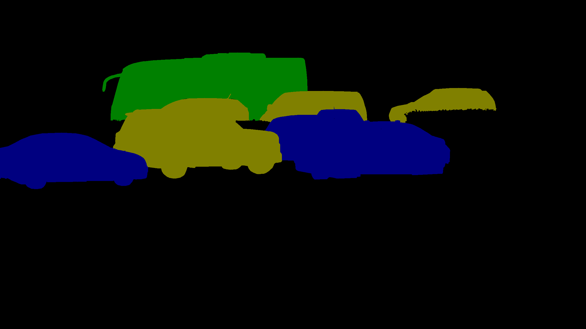
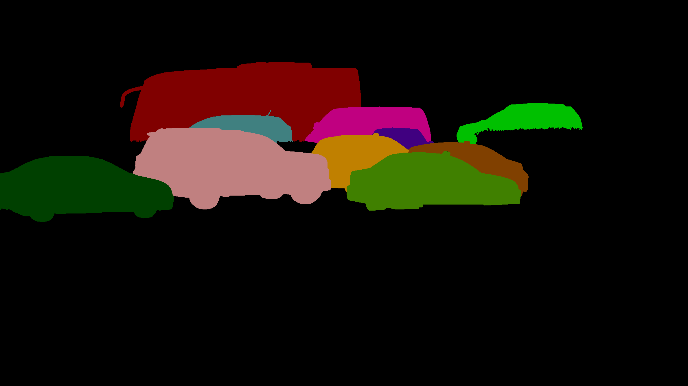

# Convert exported "polygon segmentation" JSON files to "bitmap mask" images
* Convert Polygons annotations exported from Image and Video Projects to bitmap mask images.

## Pre-requisite
* Python 3.6+
* Install python dependencies
```
$ pip install -r requirements.txt
```
* WIP: Docker version

## Convert Export Results
* Download the export results from the Export History Tab [Link](https://docs.superb-ai.com/docs/export-and-download-labels)
   * Sample export results, one for image and video project each, are available in the [exports](exports) folder.

* [Export result format](https://docs.superb-ai.com/docs/export-result-format)
    * Previously, bitmap mask images were included in exported zip files but this function has been deprecated.
    * Please use this code to create bitmap masks for polygon segmentations.

* Note! - Only labels submitted through [our annotations app](https://docs.superb-ai.com/docs/create-edit-and-delete-annotations) will be processed to create the mask images. This code will skip any labels that did not go through our annotation app after being Auto-labeled or uploaded using the CLI/SDK.

* The color map that we use to create the masks is hard-coded. Please feel free to check and edit our code to change the colors. The color of the mask images will be different from the colors you see on the web interface (our detailed view or annotation app).
   * This is because our mask uses 8-bit color map to represent pixel values from 0 to 255
   * Class and instance index starts from 1, with respect to the 'object_classes' list in the project.json file or 'objects' list in each of the label JSON files. 

<p float="middle">
  
  
  
</p>

### Image (New) Project
* If you've selected "Image (New)" as the project's Data Type, you can run the following code. 
```
# After downloading the exported zip file, move it to the "exports" folder
# Then, unzip your exported file
# (Please change "image-sample.zip" below to your exported file name accordingly) 
$ cd exports; unzip image-sample.zip; cd ..

# run the following code to generate bitmap mask images 
$ cd src
$ python main.py --path ../exports/
```


* masks will be saved under the following directory
```
exports
└─ project.json              # projects.json, labels folder and meta folder, as existed before
└─ labels
└─ meta
└─ masks                     # masks directory is created
   └─ classId                # objects of the same class will be drawn in the same color (i.e. semantic segmentation) 
      └─ {group-name}        # group-name directory will be created if you have specified class groups in the project configurations
         └─ {label-id}.png
            ...
         ...
   └─ instanceId             # each object will have a different color (i.e. instance segmentation) 
      └─ {group-name}        # group-name directory will be created if you have specified class groups in the project configurations
         └─ {label-id}.png
            ...
         ...
```


### Video Project 
* If you've selected "Video" as the project's Data Type, you can run the following code. 
```
# After downloading the exported zip file, move it to the "exports" folder
# Then, unzip your exported file
# (Please change "video-sample.zip" below to your exported file name accordingly) 
$ cd exports; unzip video-sample.zip; cd ..

# run code
$ cd src
$ python main.py --path ../exports/
```


* masks will be saved under the following directory
```
exports
└─ project.json              # projects.json, labels folder and meta folder, as existed before
└─ labels
└─ meta
└─ masks                     # masks directory is created
   └─ classId                # objects of the same class will be drawn in the same color (i.e. semantic segmentation) 
      └─ {group-name}        # group-name directory will be created if you have specified class groups in the project configurations
         └─ {label-id}
            └─ 00000000.png
            ├─ 00000001.png
               ...
            ...
         ...
   └─ instanceId             # each object will have a different color (i.e. instance segmentation) 
      └─ {group-name}        # group-name directory will be created if you have specified class groups in the project configurations
         └─ {label-id}
            └─ 00000000.png
            ├─ 00000001.png
               ...
            ...
         ...
```
